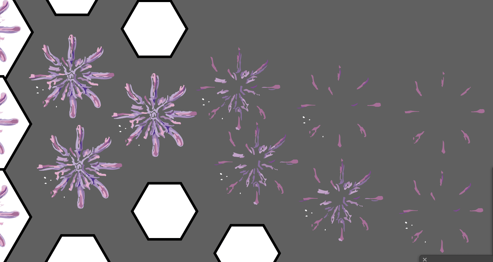

# Sample Readme File
##### Names and affiliations, project date. 


Don't forget to add an image, it really helps us understand your project better. 

This is a project description. Make sure its clear and detailed. It doesn't have to be very formal, but it should be clear and concise. Imagine you've never seen this repository before! 

Describe what you've made and how it works, who it is for and why you made it. You may want to include multiple images or drawings or diagrams. Use spell check. 

## Installation
Here, you'll describe how to run your code. Do you have libraries? Do you need to configure something? Make it clear, provide inks and commands. 
``` You can add code like this if needed  ``` 

Users should be able to copy/paste the code and run it in the terminal or copy the URL and download what they need. 

If you need to edit code to make it work, like commenting out or running specific lines for certain features, you can detail it here. 

## Run
How to run your code? If there is a command, write it. Does the browser need to be resized? Do you need to connect a microphone? Tell us!

If your work needs a physical setup or other hardware, describe it here, or give us a diagram.

## Future iterations
What do you hope to add in the future and what did you not have time for? 

## Sketches, ideas
Include any sketches, mood boards, or ideas you went through. Explain them clearly. 

## Credits, resources, etc 
Add any links to tutorials or resources you used or things you found helpful! 

## Anything else? 
Add it!

## Notes on code comments and documentation

Documentation is a critical part of writing code. It is for you, but also for others you might want to share your code with. If you have ever used code written by someone else, think about what they could have done to help you understand it better. If you're proud of your code, documenting it can help others learn.

Imagine: its 2 years from now and you've completely forgotten what you wrote, and your gallery show has to be installed tomorrow. Your code almost works, but you can't remember what you wrote. What might help you make changes quickly and remember what you write?

- Always comment your code. Add your name and project title in the main code file.  
- Every function should be named described clearly according to what they do.  
- All variables should have clear and reasonable names that describe what they do. 
- Sections of code that make decisions or perform complex tasks should be described clearly in comments.  
- Sections of code borrowed from other places should be cited and linked.  
- Old code should be removed!  
- Make your readme file clear and readable. 
